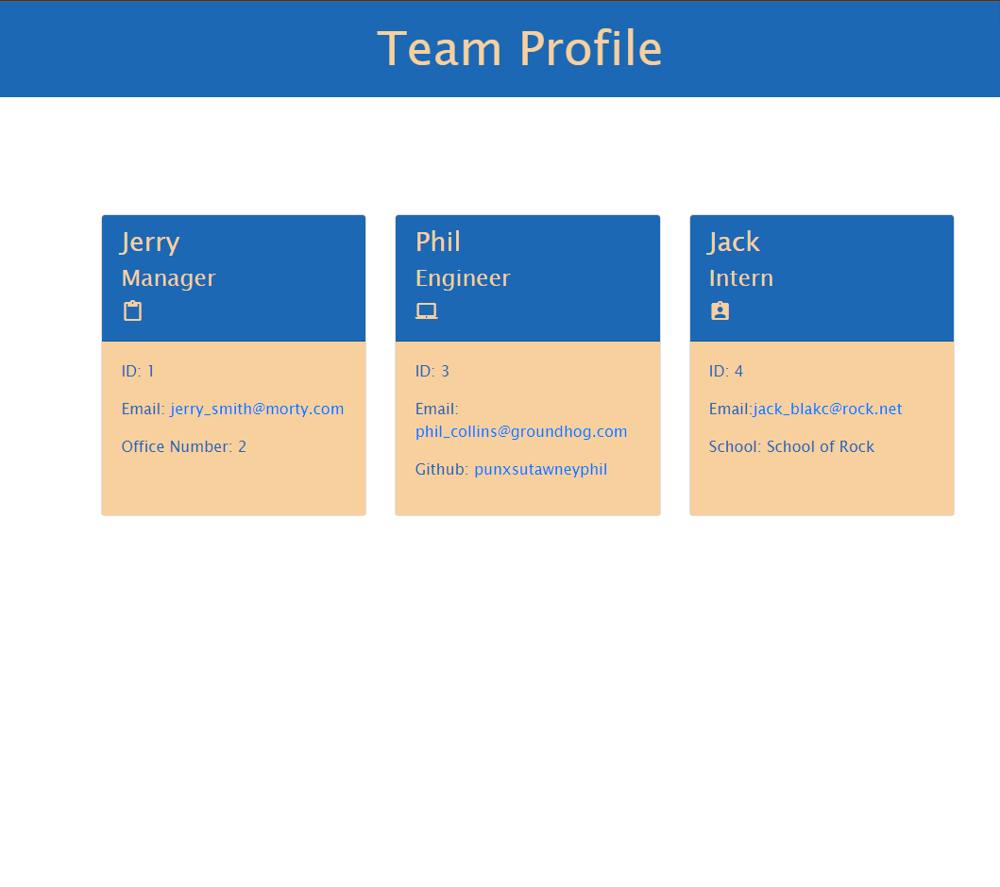

# Team Profile Generator 

## Description 
This app creates a team profile based on user input, using Inquirer. It then uptates the HTML page with the information entered.
 
## Table of Contents
* [Installation](#installation)
* [Usage](#usage)
* [License](#license)
* [Tests](#tests)
* [Questions](#questions)

## Installation 
Clone the repository from github. Make sure node is installed and run npm i. 

## Usage 
Run npm start, then answer questions from inquirer to add your data.

## License 
This project is license under MIT

## Tests
Simply run `npm test`. 

## Questions
If you have questions you can email me at jhovanslander@hotmail.com, or find my github at https://github.com/Ross-Boughman.

## Mock-Up

The following image shows a mock-up of the generated HTML’s appearance and functionality:

## Video Demo:

A link to a video of the code functionality. 
[Demo](https://drive.google.com/file/d/1pmNeJa5HnskLC3Xbn8qVbKjYAsbuPqGn/view)